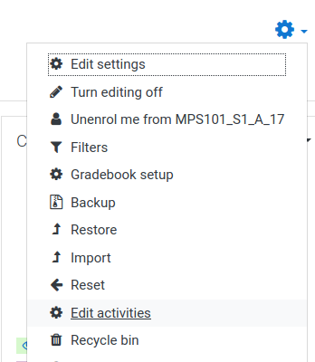
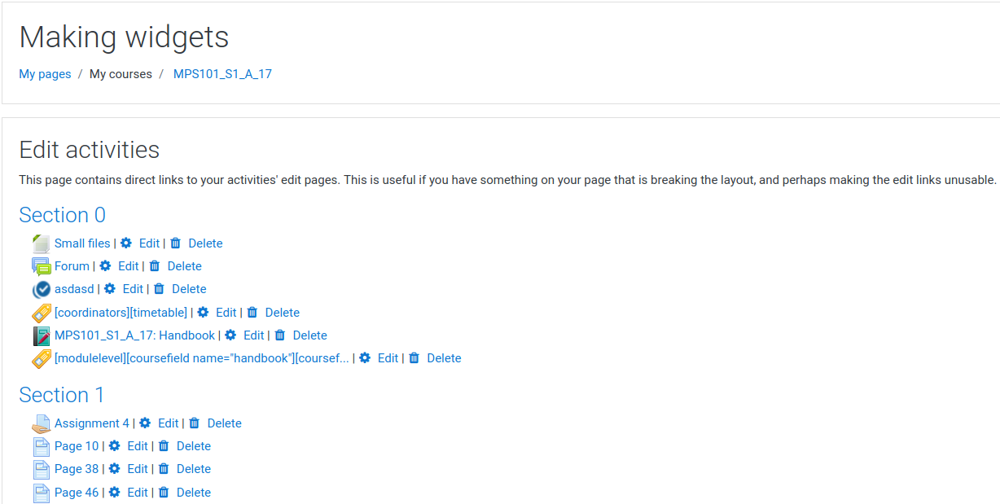

# moodle-tool_modedit

Provides edit and delete links to all activities and resources on a page. This is useful if there's some content that has broken the page layout.

The plugin provides a new course menu item "Edit activities", this is available to anyone with the capability: 'moodle/course:manageactivities'.

This link will take the user to a page that groups all the course's activities by Section. Only the activity titles are provided, along with Edit and Delete links. No activity content is provided.

## Installation

1. Unzip.
2. Place contents into admin/tool/modedit.
3. Run installation.